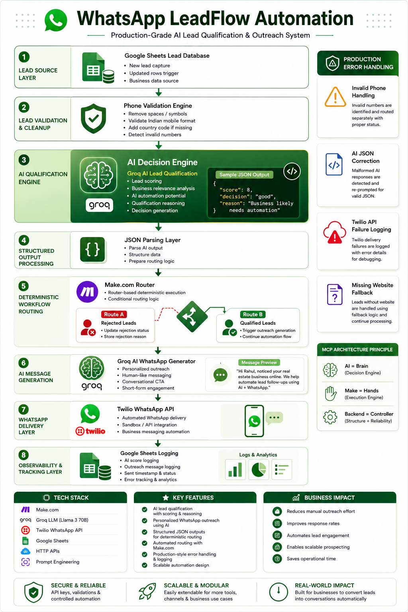
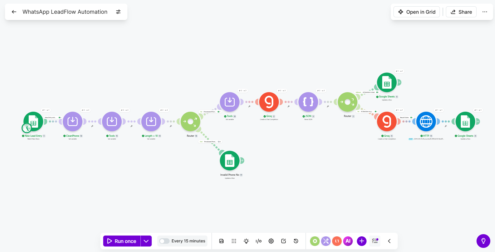
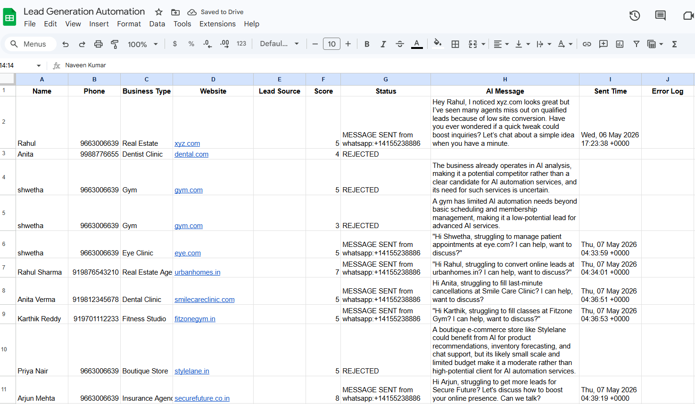
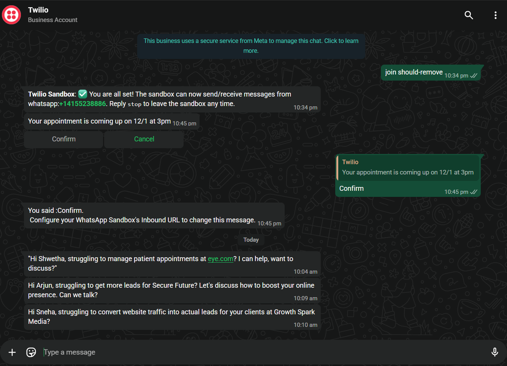

# 🚀 WhatsApp LeadFlow Automation

> AI-powered lead qualification and personalized WhatsApp outreach automation built using Make.com, Groq LLMs, Twilio WhatsApp API, and Google Sheets.

---

# 📌 Infographic Overview



---


# 📌 Overview

LeadFlow AI automates the entire lead outreach pipeline:

- Captures leads from Google Sheets
- Cleans and validates phone numbers
- Uses AI to qualify leads
- Generates personalized WhatsApp outreach messages
- Sends messages automatically using Twilio WhatsApp API
- Logs success/failure back into Google Sheets

This project demonstrates real-world AI automation architecture using no-code workflows, LLM APIs, business logic routing, and production-style error handling.

---

# 🎯 Problem Solved

Businesses waste significant time:

- manually filtering leads
- writing outreach messages
- following up with prospects
- validating contact information
- tracking outreach status

LeadFlow AI solves this by automating:

✅ Lead qualification
✅ AI-powered personalization
✅ WhatsApp outreach
✅ Logging & tracking
✅ Invalid lead filtering

---

# 🧠 Key Features

## ✅ AI Lead Qualification
Uses Groq LLMs to:
- score leads
- classify good vs bad leads
- provide qualification reasoning

---

## ✅ AI WhatsApp Message Generation
Creates:
- short
- human-like
- personalized
- conversational outreach messages

---

## ✅ Phone Number Validation
Automatically:
- removes spaces/symbols
- validates Indian mobile format
- appends country code if missing
- routes invalid numbers separately

---

## ✅ Automated WhatsApp Messaging
Uses Twilio WhatsApp Sandbox API to:
- send outreach messages automatically
- support scalable business outreach

---

## ✅ Error Handling
Handles:
- invalid phone numbers
- malformed AI responses
- Twilio API failures
- missing website data

---

# 🏗 Architecture

```text
Google Sheets
      ↓
Phone Validation + Cleanup
      ↓
Groq AI Lead Qualification
      ↓
JSON Parsing
      ↓
Router
 ├── Rejected Leads
 └── Qualified Leads
          ↓
Groq AI Message Generation
          ↓
Twilio WhatsApp API
          ↓
Google Sheets Logging
```




---

# ⚙️ Tech Stack

| Category | Tool |
|---|---|
| Automation | Make.com |
| AI Model | Groq (Llama 3 70B) |
| Messaging | Twilio WhatsApp API |
| Database | Google Sheets |
| AI Workflow | Prompt Engineering |
| APIs | HTTP Modules |

---

# 📂 Project Structure

```text
project/
│
├── make-blueprints/
│   └── WhatsApp LeadFlow Automation.blueprint
│
├── prompts/
│   ├── LeadFlow_AI_Prompts.md
│
├── docs/
│   ├── images
│       ├── GoogleSheet_DB.png
│       ├── Make-Workflow.png
│       ├── Sample-WhatsApp-Message.png
│   └── supporting docs
│       ├── Lead Generation Automation.xlsx
│
├── README.md
│
└── FAQs.md
```

---

# 🧩 Workflow Breakdown

## 1. Google Sheets Trigger
Watches for:
- new leads
- updated rows

---

## 2. Phone Validation Module
Cleans:
- spaces
- brackets
- plus signs

Validates:
- Indian mobile format
- country code consistency

---

## 3. AI Lead Qualification
Groq evaluates:
- business relevance
- AI automation potential
- lead quality

Returns:

```json
{
  "score": 8,
  "decision": "good",
  "reason": "Business likely needs automation"
}
```

---

## 4. Router Logic

### Route A
Rejected Leads:
- updates sheet status
- stores rejection reason

### Route B
Qualified Leads:
- generates AI outreach message
- sends WhatsApp message

---

## 5. WhatsApp Message Generation
Example:

> Hi Rahul, noticed your real estate business online. Many agencies lose leads due to delayed follow-ups. We help automate this using AI + WhatsApp. Open to a quick chat?

---

## 6. Twilio WhatsApp API
Uses:
- HTTP POST request
- Twilio Sandbox
- WhatsApp Business API

---

## 7. Google Sheets Logging
Logs:
- lead score
- AI message
- sent time
- error details
- final status

---

# 🛡 Error Handling

## Implemented Error Routes

| Error Type | Handling |
|---|---|
| Invalid Phone | Routed separately |
| Twilio Failure | Logged to Google Sheets |
| AI JSON Failure | Prompt correction |
| Missing Website | Fallback handling |

---

# 📸 Workflow Screenshots

## Make.com Workflow
- AI qualification pipeline
- Router logic
- Twilio integration
- Error handling routes

## Google Sheets Database
- lead tracking
- AI-generated messages
- delivery logs

## WhatsApp Delivery
- automated AI-generated outreach
- successful Twilio delivery

---

# 🔥 Sample AI Message

> Hi Anita, struggling to fill last-minute cancellations at Smile Care Clinic? We help clinics automate follow-ups using AI + WhatsApp. Open to a quick discussion?

---

# 📊 Google Sheets Schema

| Column | Purpose |
|---|---|
| Name | Lead name |
| Phone | WhatsApp number |
| Business Type | Industry |
| Website | Company site |
| Lead Source | Source platform |
| Score | AI qualification score |
| Status | SENT / REJECTED / FAILED |
| AI Message | Generated outreach |
| Sent Time | Delivery timestamp |
| Error Log | API failures |

---

# 🚀 How to Run

## Step 1 — Setup Google Sheet
Create columns:
- Name
- Phone
- Business Type
- Website
- Status

---

## Step 2 — Setup Groq API
Create:
- Groq account
- API key

Use model:

```text
llama3-70b-8192
```

---

## Step 3 — Setup Twilio Sandbox
Enable:
- WhatsApp Sandbox

Join sandbox using:

```text
join <sandbox-code>
```

---

## Step 4 — Import Make.com Blueprint
Import:

```text
leadflow-ai-blueprint.json
```

---

## Step 5 — Add Credentials
Configure:
- Groq API Key
- Twilio SID
- Twilio Auth Token
- Google Sheets connection

---

# 🧠 AI Prompt Engineering

## Lead Qualification Prompt

- scores lead quality
- classifies lead intent
- returns strict JSON

---

## WhatsApp Prompt

Generates:
- concise outreach
- human tone
- conversational CTA

---

# 📈 Real-World Business Value

## Benefits

- Reduces manual outreach effort
- Improves response rates
- Enables scalable lead engagement
- Demonstrates production AI automation skills

---

# 🏆 Skills Demonstrated

## AI Engineering
- Prompt Engineering
- Structured AI outputs
- LLM integration

## Automation Engineering
- Make.com workflows
- API integrations
- Routing logic
- Error handling

## Product Thinking
- Business automation
- Lead qualification
- Outreach optimization

---

# 📬 Contact

If you'd like to collaborate, discuss AI automation, or explore workflow engineering opportunities, feel free to connect.

---

# ⭐ Final Note

This project was designed with a strong focus on:

- real-world business value
- scalable automation design
- AI integration best practices
- portfolio and interview impact

---

## 🔥End of WhatsApp LeadFlow AI Automation

